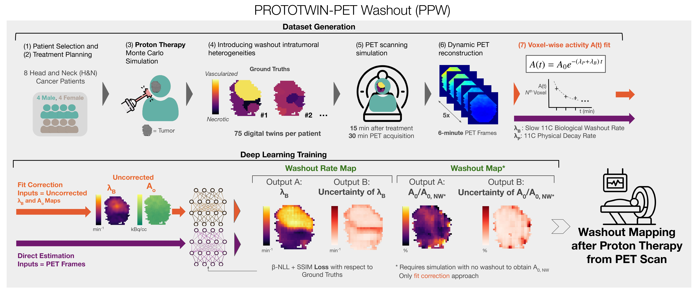

# PROTOTWIN-PET-Washout: Mapping Intratumoral Heterogeneity Through PET-derived Washout and Deep Learning After Proton Therapy



This repository was developed by Pablo Cabrales, PhD candidate at the Nuclear Physics Group, Complutense University of Madrid. Please e-mail [pcabrale@ucm.es](mailto:pcabrale@ucm.es) for any inquiries.

## Introduction 📚

The distribution of produced isotopes during proton therapy can be imaged with Positron Emission Tomography (PET), potentially enabling dose delivery verification. However, biological washout---driven by processes like perfusion and cellular metabolism---reduces PET signal-to-noise ratio (SNR) and limits reliable quantitative analysis. To improve estimation of washout parameters in post-proton-therapy PET---thereby enabling correction for biological washout---and to map intratumoral heterogeneity in washout dynamics as a marker of tumor status and treatment response, we propose a deep learning, uncertainty-aware framework. The models are trained on Monte Carlo–simulated data from 8 head-and-neck cancer patients, and tested on 4 additional head-and-neck and 1 liver patient. Each patient is represented by 75 digital twins with different tumoral washout dynamics and imaged 15 minutes after treatment, when slow washout components dominate. We compare two approaches: direct deep learning estimation of washout rate maps from the noisy PET frames, and deep learning correction of washout rate maps fitted to the PET frames. Results demonstrated significantly improved resolution and accuracy, with the fit correction approach reducing median absolute errors by 65%. For intratumoral regions with volumes as small as 3mL, errors predominantly fall below thresholds for differentiating vascular status. The model generalizes across anatomical areas, PET scanners, and acquisition delays. We also propose a novel metric, the washout fraction, which quantifies the contribution of medium and fast washout components to the reduction in activity occurring between the end of treatment and the start of PET imaging. This study highlights the potential of deep learning and modern time-of-flight PET to non-invasively map washout kinetics, supporting dose verification, tumor characterization, and potential treatment adaptation. 

Developing the PPW framework involves two main steps. First, a dataset of ground truth biological washout parameter maps is generated, and the corresponding proton therapy treatments and PET acquisitions are simulated. Second, a deep learning model is trained using this dataset to estimate biological washout and washout rate maps. We develop the framework based on an offline PET imaging workflow for head and neck cancer patients. However, substantial changes in application conditions may require redeveloping the framework, including dataset generation and model retraining, to achieve optimal performance. To enable this adaptation, we have open-sourced the framework code here and highlighted the variables that need to be modified in the code.

PROTOTWIN-PET Washout is part of the PROTOTWIN project, which aims to guide proton therapy using PET imaging, in this case by improving dose verification and biological tumor characterization.

## Repository Table of Contents 📑
1. [Data](/data)
2. [Images](/images)
3. [Source code and additional files](/src)
4. Other GitHub files

## Set Up Environment 🧱

Begin by cloning the entire repository and navigating to the project directory:
```bash
git clone https://github.com/pcabrales/ppw.git
```

This is a Python-based project. Creating a conda environment is recommended to manage the dependencies. If conda is not already installed, install it from the [official site](https://www.anaconda.com/download/success). To create and activate the conda environment with the necessary packages, run:
```bash
conda env create -f environment.yml
conda activate prototwin-pet-washout
```

You will also need:
- [MatRad](https://e0404.github.io/matRad/) for treatment planning of different patients.
- CUDA Toolkit 12.3 or higher. It may work with lower versions, but it has only been tested with 12.3 and 12.4.
- FRED Monte Carlo GPU v 3.70.0:
    - Install from the [official site](https://www.fred-mc.org/Manual_3.70/Download/Latest%20release.html#latestrelease)
- MCGPU-PET software:
    - Install from the [official GitHub page](https://github.com/DIDSR/MCGPU-PET.git)
    - In the `Makefile` line:
        ```bash
        GPU_COMPUTE_CAPABILITY = -gencode=arch=compute_75,code=sm_75
        ```
        change the `75` to match your GPU compute capability.
        For example, for a GPU with compute capability 8.9, change `75` to `89`. For a list of compute capabilities, refer to the [CUDA GPUs](https://developer.nvidia.com/cuda-gpus) page.
    - If your CUDA does not include the `samples` folder, you will need to download the [cuda-samples repository](https://github.com/NVIDIA/cuda-samples.git) and place it in the `CUDA` directory. Then, in the `Makefile`, change the `CUDA_SDK_PATH` to `path/to/cuda-samples/Common/`.
    - Install as instructed in the `README.md` and place the `MCGPU-PET.x` executable in `src/pet-simulation-reconstruction/mcgpu-pet/`.
    - The input files `MCGPU-PET-vision.in` and `MCGPU-PET-quadra.in` for the different available scanners are already included in `src/pet-simulation-reconstruction/mcgpu-pet`
After installing the necessary software, restart your terminal or update your environment variables:
```bash
source ~/.bashrc
```

## Usage 🚀

### Step 1: Select Patients and Plan Treatment 🧑‍⚕️
- For each patient, create a folder in the `data` directory with the patient ID (e.g. `HN-CHUM-018`). 
- In our study, we selected head and neck patients "HN-CHUM-007",
    "HN-CHUM-010",
    "HN-CHUM-013",
    "HN-CHUM-015",
    "HN-CHUM-017",
    "HN-CHUM-018",
    "HN-CHUM-021",
    "HN-CHUM-022",
    "HN-CHUM-027",
    "HN-CHUM-053",
    "HN-CHUM-055",
    "HN-CHUM-060", from the [Head-Neck-PET-CT dataset](https://www.cancerimagingarchive.net/collection/head-neck-pet-ct/), which is available to the public but requires registration and approval. Eight of these patients were used for training and four for testing.
    - In a single folder (outside this repository), for each patient, place the CT (`dcm` files for each axial slice) and RTSTRUCTs (single `dcm` file) for MatRad processing.
    - Run `matRadGUI` in MATLAB and click "Load DICOM" in the Workflow box (top left). Select the directory by clicking on the patient ID.
    - Save the .mat file by clicking "Import". Save it to `path/to/matRad-master/phantoms/HN-CHUM-018.mat`.
    - Copy the provided `src/matRad_head_protons_prototwin_pet_washout.m` file to the MatRad base directory and run it. This is adapted from the `matRad/examples/matRad_example5_protons.m` script, found [here](https://github.com/e0404/matRad/blob/master/examples/matRad_example5_protons.m).
- An example, including the treatment plan struct (`matRad-output.mat`) necessary to generate the dataset, is given for a liver patient from the [CORT](https://academic.oup.com/gigascience/article/3/1/2047-217X-3-37/2682969) dataset at `data/LIVER/`. The liver patient was used for testing only.

### Step 2: Generate Dataset 🛠️
Run the dataset generation script, changing the `USER-DEFINED PROTOTWIN-PET PARAMETERS` inside the script as needed:
- For the fit correction approach (see introduction for details):
```bash
python src/generate_dataset_fit_correction.py
```
- For the direct approach (see introduction for details):
```bash
python src/generate_dataset_direct_estimation.py
```
#### These scripts use:
- FRED for the proton therapy MC simulation (taking the treatment plan from `data/patient/matRad-output.mat`).
- MCGPU-PET for the PET simulation (using the simulated proton therapy output and files at `src/pet-simulation-reconstruction/mcgpu-pet/`).
- parallelproj for the dynamic PET reconstruction (calling functions at `src/utils_parallelproj`). 
- Functions at `src/utils_regions.py` for the generation of the ground truth biological washout parameter maps for each digital twin.
- General utility functions for the dataset generation at `src/utils_generate_dataset.py`.

#### These scripts output (to the `data/patient` directory):
- Simulated PET frames and reconstructed biological washout parameter maps for each digital twin (inputs for direct estimation and fit correction approaches, respectively), as well as images displaying slices of them.
- Ground truth biological washout parameter maps for each digital twin (targets).
- FRED and MCGPU-PET log files for each digital twin.
- Timing files for each digital twin.
- Other files, including the tumor mask and the patient CT.

### Step 3: Train and/or Test the Deep Learning Model 🤖
Run the main script, changing the `USER-DEFINED PROTOTWIN-PET PARAMETERS` inside the script as needed:
- For the fit correction approach (see introduction for details):
```bash
python src/run_model_fit_correction.py
``` 
By default, washout rate maps are corrected. To obtain corrected washout (washout fraction) maps, set `estimating_washout_fraction = True`:
- For the direct approach (see introduction for details):
```bash
python src/run_model_direct_estimation.py
```
#### These scripts use:
- The nnFormer deep learning model, saved at `src/models/nnFormer` adapted from the [official GitHub page](https://github.com/282857341/nnFormer) and the [3D UX-Net implementation](https://github.com/MASILab/3DUX-Net.git).
- The training and testing scripts at `src/utils_train.py` and `src/utils_test.py`, respectively.
- Data processing and plotting functions at `src/utils_model.py`.

#### These scripts output:
- The trained model, saved to `src/models/trained-models`.
- Training times, saved to `src/models/training-times`.
- Training and validation losses, saved in `csv` files at `src/models/losses`.
- Model sizes and complexities, saved to `src/model-sizes`.
- Test set model validation metrics, saved to `src/models/test-results`.
- Images, displaying error metrics and washout maps, saved to `images`.


## License 📄
This project is under a GNU General Public License v3.0.

---